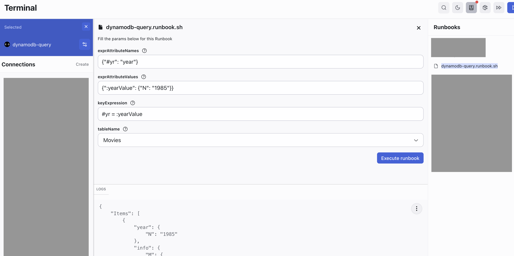
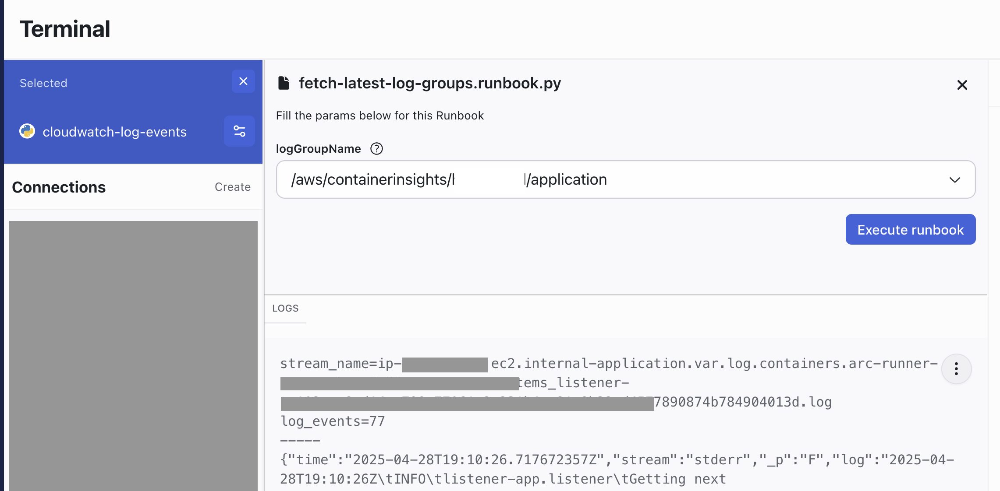

# AWS Runbook Examples

Contain AWS runbook examples.

Refer to the [Runbook Configuration guide](https://hoop.dev/docs/setup/configuration/runbooks-configuration) to integrate your repository with Hoop.

> Make sure to use the latest version of the agent when running these examples.

## Dynamo DB Query

This runbook provides a wrapper arround the `aws dynamodb query` command line.

### Setup

1. Copy the file `dynamodb-query.runbook.sh` to your runbook directory
2. Create a connection exposing the command `bash` as the entrypoint.

```sh
hoop admin create conn dynamo-db-query -a <agent-name> \
  -e AWS_ACCESS_KEY_ID=<access-key> \
  -e AWS_SECRET_ACCESS_KEY=<secret-key> \
  -e AWS_DEFAULT_REGION=<aws-region> \
  -- bash
```

It requires the following IAM permissions:
- `dynamodb:Query`

> This example was tested with the [Movies Getting Started](https://000060.awsstudygroup.com/3-gettingstartedwithawssdk/).



## AWS Cloudwatch Log Events

This runbook is a python script that queries the CloudWatch API and fetch the latest log entry

### Setup

1. Copy the file `cloudwatch-log-events.runbook.py` to your runbook directory
2. Create a connection exposing the command `python3` as the entrypoint.

```sh
hoop admin create conn cloudwatch-log-events -a <agent-name> \
  -e AWS_ACCESS_KEY_ID=<access-key> \
  -e AWS_SECRET_ACCESS_KEY=<secret-key> \
  -e AWS_DEFAULT_REGION=<aws-region> \
  -- python3
```

It requires the following IAM permissions:
- `logs:DescribeLogStreams`
- `logs:GetLogEvents`

